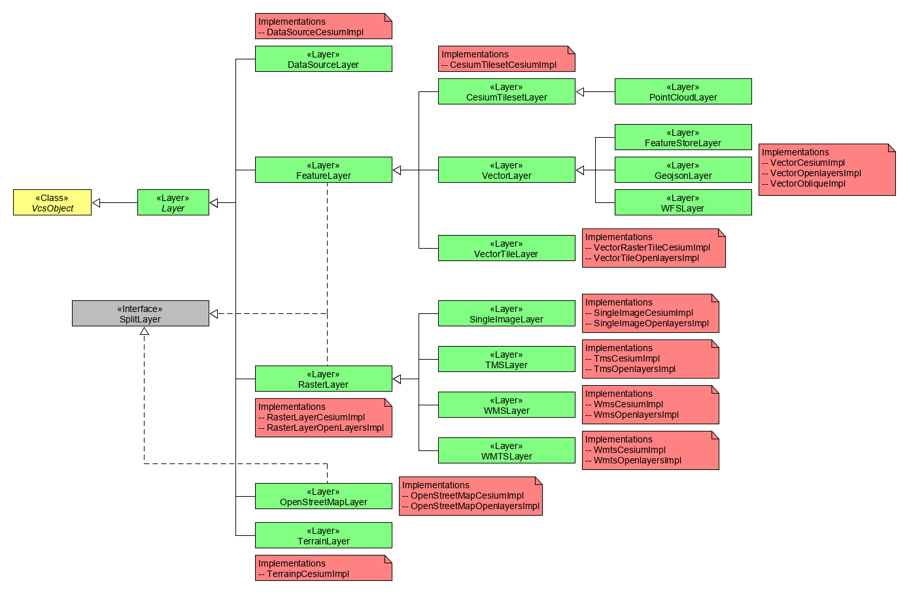

# Layers

A layer is the representation of a geographic dataset within a map environment.
Layers can contain vector or raster data. The [@vcmap/core](../README.md) offers a variety of layer classes to visualize different types of data.

All layers of a map are managed in a [LayerCollection](../src/util/layerCollection.js), which takes care of rendering order and layer exclusivity.
The layer collection is passed to a [Map](../src/map/vcsMap.js) for layers available to said map. Layers within a LayerCollection must have unique names.

## Layer types

The abstract base [layer](../src/layer/layer.js) class is derived from the [VcsObject](../src/vcsObject.js) class.
It defines standard properties of layers, like `extent`, `state`, `supportedMaps`, its source (`url`) and attributions (`copyright`).

Further child classes for both vector and raster data are available.
Since the [@vcmap/core](../README.md) is a framework supporting a 2D, 3D and oblique view, it has a concept called LayerImplementations.
A [LayerImplementation](../src/layer/layerImplementation.js) represents an implementation for a [Layer](../src/layer/layer.js) for a specific [Map](../src/map/vcsMap.js).
Whenever a map is active an implementation of all supported layers will be generated for this map type.
The implementation takes care of initializing and viewing the datasource on the specific map.
Some layers only relevant for one specific map, e.g. [TerrainLayer](../src/layer/terrainLayer.js) for 3D, only provide an implementation for this map, in that case [CesiumMap](../src/map/cesiumMap.js).

The following diagram gives an overview over all available layer types and their corresponding implementations:


## SplitLayer

The SplitLayer interface is implemented by split-able layers, namely (and their childs):
- CesiumTilesetLayer
- VectorLayer
- RasterLayer
- OpenStreetMapLayer

The interface is defined as:
```js
/**
 * @typedef {import("@vcmap/core").Layer} SplitLayer
 * @property {import("@vcmap/cesium").SplitDirection} splitDirection
 * @property {VcsEvent<import("@vcmap/cesium").SplitDirection>} splitDirectionChanged
 */
```

## Configuration

When instancing a [Layer](../src/layer/layer.js) options can be provided. The options vary depending on the layer type.
The base options of a layer are defined as:
```js
/**
 * @typedef {VcsObjectOptions} LayerOptions
 * @property {string|undefined} name - the name of the layer, used to retrieve the layer from the framework. if not specified, a uuid is generated
 * @property {boolean} [activeOnStartup=false] -  if true the layer will be activated on initialization
 * @property {boolean} [allowPicking=true] - whether to allow picking on this layer
 * @property {number|undefined} zIndex - zIndex of this layer
 * @property {ExtentOptions|undefined} extent - metadata on the data extent of the layer.
 * @property {Array<string|symbol>|undefined} [exclusiveGroups=[]] -
 * @property {Array<string>|undefined} mapNames - the map names on which this layer is shown, all if empty
 * @property {string|Object|undefined} url - for most layers, a resource url will be needed
 * @property {Array<string>|undefined} hiddenObjectIds - an array of building ids which should be hidden if this layer is active
 * @property {CopyrightOptions|undefined} copyright
 * @api
 */
```
For specific layer options please refer to the API docs or class definition.
