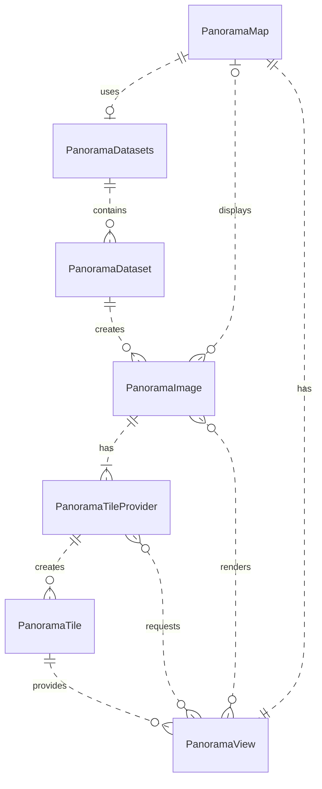

# Panorama

Panorama image handling in the VCMap.

# Data Structure & Format

The following outlines the two levels of data structure for panorama images in the VCMap. Basically we have to distinguish between
a data set of images, and the images themselves.

## Panorama Dataset

A panorama dataset consists of multiple panorama images along with a FlatGeobuf file (MUST be named images.fgb),
which contains the position the images. The FlatGeobuf file is used to geolocate the individual images and store
essential information of each image. The images.fgb file MUST exclusively contain point features, representing
the geographical location of each panorama image. The required coordinate reference system MUST be WGS84 (EPSG code 4326).
The FlatGeobuf MUST contain the following columns:

- `name` (string): The name of the image. This is used to reference the image within the dataset and must
  be unique to the dataset.
- `time` (string): An ISO timestamp representing the capture time of the image.

Each image referenced in the `images.fgb` MUST provide at least a color image, relative to the `images.fgb`.
Optionally, an intensity and a depth image MAY be provided.

The three files associated with _one_ image name MUST follow the following naming convention within the dataset:

- Color image: `${name}_rgb.tif`
- Intensity image: `${name}_intensity.tif`
- Depth image: `${name}_depth.tif`

These image files MUST be in the same directory as the `images.fgb`.

## Panorama Image

This is the actual image data and MUST be provided as a Cloud Optimized GeoTIFF (COG). There are three files that can be
associated with one panorama image:

1. A color image, which is the actual image data.
2. An intensity image, represents the intensity of the associated depth image values.
3. A depth image, which is a greyscale image that represents the depth of the image.

### Color Image

The color image is intended for visualization. It will be rendered on a sphere and MUST have an aspect ratio of 2:1
(width:height) and be _without_ NoData padding. The image MUST be flipped on the Y axis, since it is viewed from
_within_ a sphere (more on [projection](#projection-into-3d-space). The image MUST be tiled using a geographic tiling scheme with two level 0 base tiles.
Tile levels are represented by image overviews. Each tile MUST be square (same height as width in pixels).
Each TIFF overview MUST fit into the tiling scheme _exactly_ (see [Tiling Scheme](#tiling-scheme-for-visualization)
for more details). The color image MUST have three bands (RGB) and SHOULD be compressed using WEBP compression.

The color image is the entry point for the application to access the data. It SHOULD provide information on its position,
orientation and the availability of the intensity and depth images. If present, this information MUST be provided within
the non-standard TIFFTAG_GDAL_METADATA of the COG (see [gdal documentation](https://gdal.org/en/stable/drivers/raster/gtiff.html#metadata) for more details on metadata).
The following `Item`s MUST be present in the GDAL metadata for the metadata to be considered valid:

- `PANORAMA_VERSION` (string): The version of the panorama data structure. Format is `MAJOR.MINOR`. This version is `1.0`.
- `PANORAMA_POSITION` (string): The position of the image in WGS84 as defined by EPSG 4326. Format is `lat,lon,height`.
- `PANORAMA_ORIENTATION` (string): The orientation of the image in radians, given as heading, pitch and roll. Format is `heading,pitch,roll`.

The following `Item`s CAN be present in the GDAL metadata:

- `PANORAMA_INTENSITY` (0|1): Whether an intensity image is available. 1 if available, 0 (or missing) if not.
- `PANORAMA_DEPTH` (0|1): Whether a depth image is available. 1 if available, 0 (or missing) if not.

NOTE: If no metadata is given, or the metadata given is not valid, the position will be assumed to be 0, 0, 0 and the
orientation 0, 0, 0 as well.

### Intensity Image

The intensity image represents the intensity of the depth image. It is solely used for visualization.
An intensity image MUST adhere to the same requirements as the color image as regards to aspect ratio, tiling,
compression and flipping. Even though the intensity could be described by a single band,
it MUST be provided as a four band image (RGBA) and it SHOULD be compressed with WEBP. The intensity image
is not required to provide any additional metadata.

#### Tiling Scheme (for visualization)

To visualize both the color and intensity images, the images MUST provide tiff overviews which fit into a geographic tiling scheme
with two square level 0 tiles. All overviews provided MUST be consecutive. The image MAY omit any number of top level overviews.
Even though TIFF allows for tiled overviews to not fit the image size exactly, this is not permitted in this case.
A tile may NOT contain NoData values. In most cases, this requires you to resize the image so it can fit within the tiling scheme.
This is illustrated by the following example.

Given a tile size of 512x512 pixels, the following table shows the image sizes for each level:

| Level | Width | Height |
| ----- | ----- | ------ |
| 0     | 1024  | 512    |
| 1     | 2048  | 1024   |
| 2     | 4096  | 2048   |
| 3     | 8192  | 4096   |
| 4     | 16384 | 8192   |
| ...   | ...   | ...    |

Given an image with a width of 12288 and a height of 6144 the image must be resized to fit either the size of level 3 or level 4.
Once resized, overviews generated with a tile size of 512x512 will automatically fit into the tiling scheme.
If we resize the previously mentioned image to 8192x4096 (level 3), the overviews will be 4096x2048, 2048x1024,
and 1024x512 pixels given a division by 2, 4, and 8 respectively.

Since we may omit any number of top levels, just providing two overviews with a division of 2 and 4 would be sufficient (level 2 and 1).
But only creating overviews with a division of 2 and 8 (level 2 and 0) from the resized image is not permitted, since the overviews would
no longer be consecutive.

### Depth Image

The depth image is queried for distance information. It is used to determine the distance of a point in the image to the camera.
It is not rendered and thus must not comply with the tiling scheme, but it must be flipped along the Y axis to align with
the other images. The depth image MUST be a single band image with
an integer data type. For a decent relation of file size vs. precision, it is proposed to use UInt16. The
NoData value of the depth image SHOULD be 0. The depth image SHOULD be compressed using deflate compression.

The pixel value is used to interpolate the distance of a point in the image to the camera position. To this extent, the following metadata
SHOULD be present. If provided, it MUST be within the non-standard TIFFTAG_GDAL_METADATA of the COG. The following fields MUST be present for
the metadata to be considered valid:

- `PANORAMA_DEPTH_VERSION` (string): The version of the depth metadata. Format is `MAJOR.MINOR`. This version is `1.0`.
- `PANORAMA_DEPTH_MAX` (float): The maximum distance in meters.

The following values CAN be present in the GDAL metadata:

- `PANORAMA_DEPTH_MIN` (float): The minimum distance in meters. If not provided, 0.0 is assumed.

NOTE: If no metadata is given, or the metadata given is not valid, the depth values will be assumed to be within the range of 0.0
to 50.0. Assuming UInt16 data, the formula to calculate the distance is as follows:

```ts
function interpolate(
  value: number,
  min = 0,
  max = 50,
  minValue = 1,
  maxValue = 65535,
): number {
  return min + ((value - minValue) / (maxValue - minValue)) * (max - min);
}
```

#### Projection Into 3D Space

The panorama image is projected into a sphere. The sphere is positioned in 3D space using the information
provided in the metadata of the color image. The other associated images are projected into the same sphere,
at the same location with the same orientation. To place the image correctly in 3D space, the orientation
given in the metadata is used to rotate the sphere. The center of the image MUST be heading 0 and pitch 0 in image space.
The image MUST be flipped for the view to reflect the actual image.

### Creating valid Panorama Image COGs using GDAL

To create the COGs using gdal, you can do the following for the color or intensity image:

```bash
# flip the image on the Y axis and set the bounds to the whole world.
# you can also use any other tool to flip the image.
# you can also set the bounds so the image would be placed where it was captures in GIS tools (as long as the aspect ration remains 2:1)
gdal_translate -of GTiff -a_srs EPSG:4326 -a_ullr 180 90 -180 -90  input.png geo_tiff.tif
# we require 2 level zero tiles. 16384x8192 pixels will guarantee this in 5 levels with a block size of 512. you will have to calculate the correct size for your image.
gdalwarp -ts 16384 8192 -overwrite geo_tiff.tif geo_tiff_resized.tif
# add the required metadata if this is the color image. skip if its the intensity image
gdal_edit.py -mo "PANORAMA_VERSION=1.0" -mo "PANORAMA_POSITION=0,0,0" -mo "PANORAMA_ORIENTATION=0,0,0" -mo "PANORAMA_INTENSITY=1" -mo "PANORAMA_DEPTH=1" geo_tiff_resized.tif
# create the overviews. this creates levels 3 to 0, the original data is level 4. you can omit 0.
gdaladdo -r average --config GDAL_TIFF_OVR_BLOCKSIZE 512 geo_tiff_resized.tif 2 4 8 16
# create the image COG
gdal_translate geo_tiff_resized.tif panorama_rgb.tif -co COMPRESS=WEBP -co WEBP_LEVEL=85 -co TILED=YES -co COPY_SRC_OVERVIEWS=YES -co BLOCKXSIZE=512 -co BLOCKYSIZE=512
```

and for the depth image:

```bash
# ensure 16 bit grayscale
convert depth.png -colorspace Gray -depth 16 -define png:bit-depth=16 depth_16.png
# flip the image on the Y axis and set the bounds to the whole world.
# you can also use any other tool to flip the image.
# you can also set the bounds so the image would be placed where it was captures in GIS tools (as long as the aspect ration remains 2:1)
gdal_translate -of GTiff -a_srs EPSG:4326 -a_ullr 180 90 -180 -90  depth_16.png depth_tiff.tif
# add the required metadata
gdal_edit.py -mo "PANORAMA_DEPTH_VERSION=1.0" -mo "PANORAMA_DEPTH_MAX=72.12" depth_tiff.tif
# create the image COG
gdal_translate depth_tiff.tif panorama_depth.tif -of GTiff -co TILED=YES -co BLOCKXSIZE=512 -co BLOCKYSIZE=512 -co COMPRESS=DEFLATE
```

# Runtime Objects

The following objects are used at runtime to represent the panorama data.

## [PanoramaDatasetCollection](../src/panorama/panoramaDatasetCollection.ts)

The dataset collection holds all the configured datasets and is attached to the `VcsApp` as well
as the [PanoramaMap](#PanoramaMap). This is simply a normal Collection.

- Allows the loading of the _closest_ image from all active datasets.

Relations:

- The dataset collection is attached to the `VcsApp`.
- The dataset collection is attached to a [PanoramaMap](#PanoramaMap).
- Contains multiple [PanoramaDatasets](#PanoramaDataset).

## [PanoramaDataset](../src/panorama/panoramaDataset.ts)

Points to a remote [Data Set](#data-set) and wraps a [FlatGeobufTileProvider](../src/layer/tileProvider/flatGeobufTileProvider.ts)
and a [VectorTileLayer](../src/layer/vectorTileLayer.ts) to display the image positions on the map.

- Datasets are stateful and can be loaded and unloaded. Only active datasets are considered when querying images.
- Provides means to get all the images in a certain extent.
- Maintains an LRU cache of the instantiated [PanoramaImage](#PanoramaImage) objects.
- This is the main source for [PanoramaImage](#PanoramaImage) objects.

Relations:

- The dataset is contained within a [PanoramaDatasetCollection](#PanoramaDatasetCollection).
- The dataset creates [PanoramaImage](#PanoramaImage) objects.

## [PanoramaImage](../src/panorama/panoramaImage.ts)

Holds all the metadata required to render the image. This loads the COG headers and attaches them to the image

- name
- position
- orientation
- `GeoTIFF.GeoTIFF`

Behavior:

- It provides the transformation matrix to render the sphere by and an inverse to transform world to sphere coordinates.
- It provides a [PanoramaTileProvider](#PanoramaTileProvider) to load the image data.

Relations:

- Most images will have a reference to the [PanoramaDataset](#PanoramaDataset) they belong to.
- Has one or more [PanoramaTileProvider](#PanoramaTileProvider) objects. For RGB & Intensity.
- Has an optional [PanoramaDepth](#PanoramaDepth) object.

## [PanoramaTile](../src/panorama/panoramaTile.ts)

Represents the tile of an image.

- Renders as a wedge with its image data as texture.
- Caches the primitive.

Relations:

- The tile is attached to a [PanoramaTileProvider](#PanoramaTileProvider).
- The tile is rendered by the [PanoramaImageView](#PanoramaImageView).

## [PanoramaTileProvider](../src/panorama/panoramaTileProvider.ts)

A construct that is able to load image data with a certain strategy (static or COG come to mind) and provide it to the tile.

- The tile provider is valid for one image.
- Provides [PanoramaTiles](#PanoramaTile) based on tile coordinates and caches them on the image.
- Provides a method to perform „getDepth“ at a spherical coordinate and „getDepthMostDetailed“ at a spherical coordinate.
- Maintains a cache of its loaded [PanoramaTiles](#PanoramaTile). (LRU?)
- Maintains a cache of its loaded depth data. (LRU?)

Relations:

- The tile provider is attached to a [PanoramaImage](#PanoramaImage).
- Caches multiple loaded [PanoramaTiles](#PanoramaTile).

### [PanoramaDepth](../src/panorama/panoramaDepth.ts)

Is a specialized [PanoramaTileProvider](#PanoramaTileProvider) that loads depth data.
The data is not intended for rendering, and this tile provider has no [PanoramaTile](#PanoramaTile) objects.
Instead, it provides access to the depth data and allows for querying the depth at a certain spherical coordinate
to procure world cartesian positions for a given image location.

- Provides a method to get the depth at a spherical coordinate.
- Loads depth data based on the same strategy as the [PanoramaTileProvider](#PanoramaTileProvider), but
  only for the lowest level
- Maintains a cache of its loaded depth data.

Relations:

- The depth provider is attached to a [PanoramaImage](#PanoramaImage).

## [PanoramaImageView](../src/panorama/panoramaImageView.ts)

This construct is similar to the ol.View and describes a scene based on an image.

- Renders an image into the cesium scene.
- Requests [PanoramaTiles](#PanoramaTile) from the current images [PanoramaTileProvider](#PanoramaTileProvider).
- Renders the primitives as provided by the tiles loaded.
- Ensures a base level „shell“ is always rendered.
- Determines which tiles to render.
- Fires map interaction events.

Relations:

- Is attached to a [PanoramaMap](#PanoramaMap).
- Renders multiple [PanoramaTiles](#PanoramaTile) from the current [PanoramaImage](#PanoramaImage) on the map.

## [PanoramaMap](../src/map/panoramaMap.ts)

This is the `VCMap` interface which allows us to treat the panorama data as a map.

- Shows a current image (or a blank image, if there isn’t one) by using the [PanoramaImageView](#PanoramaImageView). (This behavior needs to be defined)
- Can load a Viewpoint.
- Can determine, if a viewpoint is visible (by using min / max depth)
- Can load / unload data sets. (More than one at a time?).
  - Maintains an index of all currently available images if more than one datasource can be loaded.

Relations:

- Has a [PanoramaDatasetCollection](#PanoramaDatasetCollection) attached.
- Has a [PanoramaImageView](#PanoramaImageView) attached.
- Keeps track of the current [PanoramaImage](#PanoramaImage).

## Concept: Relationship Diagram of Runtime Objects



## Concepts: Coordinate Systems

The panorama image is rendered into a sphere using the cesium renderer. There is some
coordinate magic to take into account. There are three coordinate systems to consider:

- The cartesian world coordinate system (ECEF) which is used by cesium. This is the coordinate system the camera moves in.
- The cartesian sphere coordinate system which is used to render the sphere.
  This is a coordinate system where the sphere is positioned in ECEF using the images modelMatrix. The camera is always at the origin.
  It must be ensured, that the camera is aligned to the spheres up vector. It may not roll, otherwise FOV calculations will be off.
- The spherical coordinate system of the flipped image we are rendering into the sphere.

Transformation: ECEF -> image coordinate. You can find these transformations in the `sphericalCoordinates.ts` module.
`globalCartesianToImageSpherical` does the following:

- You can move from ECEF into the spheres cartesian coordinate system by inversing the images model matrix.
- You can then place the cartesian sphere coordinate system into the spherical coordinate system by normalizing this point.
  This places the point on the unit sphere. You can then calculate the spherical coordinates.
- We then flip the X axis, same as the image data, to get the correct image coordinates.

## Concept: FOV

The FOV is defined by the camera. Once calculated in ECEF, we move it to image coordinates system and create the
bounds. Helper functions are found `panoramaCameraHelpers.ts`. The following restriction apply:

- The FOV can wrap around the X axis. You will get one in general or two bounds if it wraps around.
- We do not wrap around the Y axis. This is a restriction of the current implementation.
- Thus, you must ensure that the camera is always aligned to the spheres up vector.
- You must restrict the view, so the pole will never be in view (slightly is not a problem, since we render a shell)

## Concept: Tiling

The image data is tiled. We request tiles based on the current FOV _extent_ (we thus load too many tiles).
The tile leve is determined by the current FOV bounds number of pixel & angle _at the center_ this means, when looking
upward (or downward) higher resolution tiles are loaded then at the equator. To not tax the GPU too much we do the
following:

- We always render a level 0 (or maybe 1, could be configurable) shell around the sphere.
- Starting at level 3, we stop rendering polar regions directly, in this case, only the shell is rendered at the polar regions.

### IDEAS

- Add a high depth overview to enable "estimated" position cheaply.
